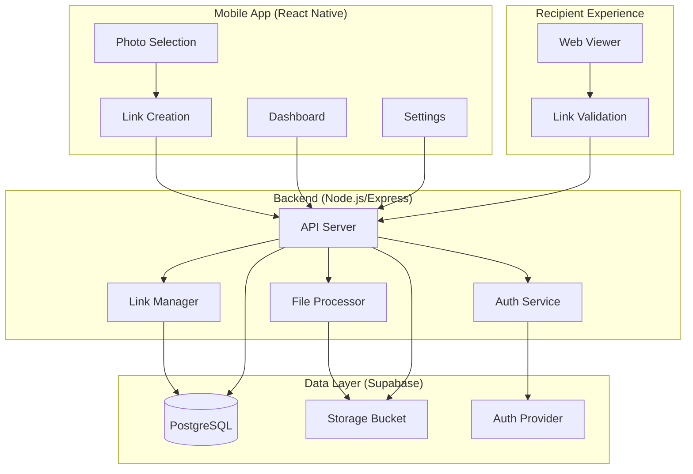

# ShareSafe MVP Implementation Plan

A controlled photo sharing app for privacy-conscious parents to share photos via time-limited, revocable links through existing messaging apps.

## User Review Required

> [!IMPORTANT]
> **Device Fingerprinting Options** (Post-MVP Feature)
> 
> For the device-based access limits feature, here are the recommended approaches:
> 
> **Option 1: Browser Fingerprinting (Recommended for MVP+)**
> - **How**: Combine User-Agent, screen resolution, timezone, language, and canvas fingerprinting
> - **Pros**: No user action required, works immediately
> - **Cons**: 
>   - Can be bypassed by changing browsers or using incognito mode
>   - Privacy concerns (though we're already privacy-focused)
>   - ~85-90% accuracy for unique device identification
> - **Libraries**: FingerprintJS, ClientJS
> 
> **Option 2: Cookie-Based Device Tracking**
> - **How**: Set a unique cookie on first access, count unique cookies
> - **Pros**: Simple, reliable for normal users
> - **Cons**: 
>   - Easily bypassed by clearing cookies or using incognito
>   - Doesn't work across browsers on same device
> - **Best for**: Casual prevention, not strict enforcement
> 
> **Option 3: Hybrid Approach (Recommended)**
> - **How**: Combine fingerprinting + cookie + IP address (with grace period)
> - **Pros**: More robust, harder to bypass accidentally
> - **Cons**: More complex, potential false positives (family on same WiFi)
> - **Implementation**: Count a "new device" only if 2+ signals differ
> 
> **Option 4: Require Recipient Authentication**
> - **How**: Recipients create accounts, track by user ID
> - **Pros**: Most accurate, enables additional features
> - **Cons**: **Violates core product principle** - no recipient friction
> - **Verdict**: ❌ Not recommended
> 
> **Recommendation**: Start with **Option 2** (cookie-based) for post-MVP, then upgrade to **Option 3** (hybrid) if needed. This balances simplicity with effectiveness while acknowledging that determined users can bypass any client-side limit.

> [!WARNING]
> **Default Expiry Changed from PRD**
> 
> The PRD specified "never" as the default expiry (line 275), but per user clarification, the default will be **1 week**. This better aligns with the product's privacy-first positioning.

> [!IMPORTANT]
> **End-to-End Encryption Required**
> 
> All photos must be encrypted client-side before upload using AES-256 encryption with unique keys per photo. For MVP, encryption keys will be stored encrypted in the database and retrieved via API. A future "Advanced Privacy Mode" will allow keys to be embedded in URL fragments (zero-knowledge architecture) for users who want maximum privacy. See the Encryption & Security Strategy section for full details.

## MVP Scope

### **MVP Features (Initial Release)**

**Core Functionality:**
- ✅ Photo sharing via controlled links
- ✅ Image size reduction (max 2048px, ~80% quality)
- ✅ Time-limited access (1 hour, 1 day, 1 week [default], 1 month, 1 year, custom)
- ✅ Manual link revocation
- ✅ Download control (allow/disallow)
- ✅ EXIF metadata stripping
- ✅ Client-side AES-256 encryption
- ✅ Optional preview thumbnails

**Authentication:**
- ✅ Apple Sign-In only

**User Experience:**
- ✅ Mobile app (iOS & Android via React Native + Expo)
- ✅ Web viewer for recipients (no signup required)
- ✅ Link dashboard (active/revoked/expired tabs)
- ✅ Basic analytics (view count, access history)

**Technical:**
- ✅ React Native Paper UI components
- ✅ Node.js + Express backend
- ✅ Supabase (PostgreSQL + Auth + Storage)
- ✅ Encryption keys stored in database
- ✅ HTTPS/TLS for all communication

### **Post-MVP Features (Future Enhancements)**

**Advanced Privacy:**
- ⏳ Device-based access limits (with cookie/fingerprint tracking)
- ⏳ URL fragment encryption keys (zero-knowledge architecture)
- ⏳ Screenshot detection warnings (native apps only)

**Additional Authentication:**
- ⏳ Google Sign-In
- ⏳ Email/Password authentication

**Enhanced Features:**
- ⏳ Family rules setup and enforcement
- ⏳ Sharing groups with custom defaults
- ⏳ Context tracking (recently shared with)
- ⏳ Deep linking to messaging apps
- ⏳ Detailed device analytics (device type, time)
- ⏳ Push notifications for link access

**Shared Rules Enhancements:**
- ⏳ Rule templates with gentle enforcement
- ⏳ Family-level vs link-level rules
- ⏳ Recipient onboarding with rule acceptance

---

## Proposed Changes

### Technology Stack

**Mobile Apps (iOS & Android)**
- **Framework**: React Native with Expo
- **Why**: Single codebase for both platforms, excellent share sheet integration, fast development
- **Alternative considered**: Native Swift/Kotlin (rejected due to duplicate effort)

**Backend**
- **Runtime**: Node.js with Express and TypeScript
- **Why**: Simple, widely supported, excellent ecosystem for file handling
- **Hosting**: Railway or Render (simple deployment, free tier available)

**Database & Auth**
- **Option A - Supabase (Recommended)**
  - PostgreSQL database + authentication + storage in one
  - Built-in Apple Sign-In support
  - Generous free tier
  - Real-time subscriptions for link status updates
- **Option B - Firebase**
  - Similar features, Google ecosystem
  - Slightly more expensive at scale

**File Storage**
- **Cloudflare R2** (S3-compatible, no egress fees) or **Supabase Storage**
- Photos stored with unique IDs, not original filenames
- Automatic deletion on expiration/revocation

**Recipient Viewer**
- **Static web app** (React/Next.js) hosted on Vercel/Netlify
- Responsive, mobile-optimized
- No authentication required

---

### Component Reusability Strategy

Use **React Native Paper** as the UI foundation with shared business components for cross-platform code reuse.

#### **Project Structure**
```
/sharing-app
  /packages
    /shared-components     # Business-specific shared components
    /shared-types          # TypeScript types/interfaces
    /shared-utils          # Business logic utilities
  /mobile                  # React Native app (uses React Native Paper)
  /viewer                  # Next.js web app (uses React Native Web + Paper)
  /backend                 # Node.js API
```

#### **UI Library: React Native Paper**

**Why React Native Paper:**
- ✅ Material Design components out of the box
- ✅ Works with React Native Web (cross-platform)
- ✅ Built-in theming system
- ✅ Excellent accessibility support
- ✅ Well-maintained and documented
- ✅ Fast development with pre-built components

**Core Components Used:**
- `Button`, `Card`, `TextInput`, `Switch`, `Badge`, `Avatar`, `ActivityIndicator`
- `Menu`, `Modal`, `Portal`, `Divider`, `Chip`
- `List`, `Surface`, `IconButton`

#### **Theme Configuration** (`/packages/shared-components/theme`)

Customize React Native Paper theme for ShareSafe branding:

```typescript
// theme/index.ts
import { MD3LightTheme, configureFonts } from 'react-native-paper';

const fontConfig = {
  fontFamily: 'Inter, -apple-system, BlinkMacSystemFont, sans-serif',
};

export const theme = {
  ...MD3LightTheme,
  fonts: configureFonts({ config: fontConfig }),
  colors: {
    ...MD3LightTheme.colors,
    primary: '#6366F1',
    primaryContainer: '#E0E7FF',
    secondary: '#10B981',
    error: '#EF4444',
    background: '#FFFFFF',
    surface: '#F9FAFB',
    surfaceVariant: '#F3F4F6',
  },
  roundness: 12,
};
```

#### **Shared Business Components** (`/packages/shared-components`)

Custom components built with React Native Paper:

```typescript
// shared-components/LinkCard/LinkCard.tsx
import React from 'react';
import { View, StyleSheet } from 'react-native';
import { Card, Text, Badge } from 'react-native-paper';
import { formatExpiry } from '@sharesafe/shared-utils';

export interface LinkCardProps {
  title: string;
  expiresAt: Date | null;
  viewCount: number;
  thumbnailUrl?: string;
  status: 'active' | 'expired' | 'revoked';
  onPress: () => void;
}

export const LinkCard: React.FC<LinkCardProps> = ({
  title,
  expiresAt,
  viewCount,
  thumbnailUrl,
  status,
  onPress,
}) => {
  return (
    <Card style={styles.card} onPress={onPress}>
      {thumbnailUrl && (
        <Card.Cover source={{ uri: thumbnailUrl }} />
      )}
      <Card.Content style={styles.content}>
        <View style={styles.header}>
          <Text variant="titleMedium" numberOfLines={1} style={styles.title}>
            {title}
          </Text>
          <Badge
            style={[
              styles.badge,
              status === 'active' ? styles.badgeActive : styles.badgeInactive,
            ]}
          >
            {status}
          </Badge>
        </View>
        <Text variant="bodySmall" style={styles.meta}>
          {viewCount} views • {expiresAt ? formatExpiry(expiresAt) : 'Never expires'}
        </Text>
      </Card.Content>
    </Card>
  );
};

const styles = StyleSheet.create({
  card: {
    marginBottom: 12,
  },
  content: {
    paddingTop: 12,
  },
  header: {
    flexDirection: 'row',
    justifyContent: 'space-between',
    alignItems: 'center',
    marginBottom: 8,
  },
  title: {
    flex: 1,
  },
  badge: {
    marginLeft: 8,
  },
  badgeActive: {
    backgroundColor: '#10B981',
  },
  badgeInactive: {
    backgroundColor: '#6B7280',
  },
  meta: {
    color: '#6B7280',
  },
});
```

**Other Shared Components:**
- `ExpirySelector` - Dropdown for expiration time
- `FamilyRulesList` - Display family rules
- `PhotoViewer` - Photo display with controls
- `EmptyState` - Empty state illustrations
- `ErrorMessage` - Error display

#### **Shared Types** (`/packages/shared-types`)

```typescript
// types/Link.ts
export interface SharedLink {
  id: string;
  shortCode: string;
  photoUrl: string;
  thumbnailUrl?: string;
  expiresAt: Date | null;
  isRevoked: boolean;
  allowDownload: boolean;
  shareText: string;
  viewCount: number;
  status: 'active' | 'expired' | 'revoked';
  createdAt: Date;
}

// types/FamilyRule.ts
export interface FamilyRule {
  id: string;
  ruleText: string;
  isTemplate: boolean;
}

// types/api.ts
export interface CreateLinkResponse {
  link: SharedLink;
  shareUrl: string;
}
```

#### **Shared Utilities** (`/packages/shared-utils`)

```typescript
// utils/formatters.ts
export const formatExpiry = (expiresAt: Date): string => {
  const now = new Date();
  const diff = expiresAt.getTime() - now.getTime();
  const days = Math.floor(diff / (1000 * 60 * 60 * 24));
  
  if (days > 1) return `${days} days left`;
  if (days === 1) return '1 day left';
  const hours = Math.floor(diff / (1000 * 60 * 60));
  if (hours > 0) return `${hours} hours left`;
  return 'Expires soon';
};

// utils/api-client.ts
export class ShareSafeAPI {
  private baseUrl: string;
  
  constructor(baseUrl: string) {
    this.baseUrl = baseUrl;
  }
  
  async createLink(photo: Blob, settings: LinkSettings): Promise<CreateLinkResponse> {
    // Shared API logic
  }
  
  async getLinks(filter?: 'active' | 'expired' | 'revoked'): Promise<SharedLink[]> {
    // Shared API logic
  }
}
```

#### **Usage in Applications**

**Mobile App:**
```typescript
// mobile/App.tsx
import { PaperProvider } from 'react-native-paper';
import { theme } from '@sharesafe/shared-components/theme';

export default function App() {
  return (
    <PaperProvider theme={theme}>
      <Navigation />
    </PaperProvider>
  );
}

// mobile/screens/DashboardScreen.tsx
import { LinkCard } from '@sharesafe/shared-components';
import { Button } from 'react-native-paper';

export const DashboardScreen = () => {
  return (
    <ScrollView>
      {links.map(link => (
        <LinkCard
          key={link.id}
          {...link}
          onPress={() => navigation.navigate('LinkDetail', { id: link.id })}
        />
      ))}
      <Button mode="contained" onPress={handleCreateLink}>
        Create New Link
      </Button>
    </ScrollView>
  );
};
```

**Web Viewer:**
```typescript
// viewer/pages/_app.tsx
import { PaperProvider } from 'react-native-paper';
import { theme } from '@sharesafe/shared-components/theme';

export default function App({ Component, pageProps }) {
  return (
    <PaperProvider theme={theme}>
      <Component {...pageProps} />
    </PaperProvider>
  );
}

// viewer/pages/[shortCode].tsx
import { Button, Card, Text } from 'react-native-paper';

export default function ViewerPage({ link }) {
  return (
    <Card>
      <Card.Cover source={{ uri: link.photoUrl }} />
      <Card.Content>
        <Text variant="bodyMedium">{link.shareText}</Text>
      </Card.Content>
      {link.allowDownload && (
        <Card.Actions>
          <Button onPress={handleDownload}>Download</Button>
        </Card.Actions>
      )}
    </Card>
  );
}
```

#### **Benefits of This Approach**

✅ **Fast MVP development** - Pre-built components accelerate development  
✅ **Consistent UI** - Material Design across mobile and web  
✅ **Built-in accessibility** - Paper handles screen readers, focus management  
✅ **Cross-platform** - Works with React Native Web for viewer  
✅ **Shared business logic** - Custom components for ShareSafe-specific features  
✅ **Easy theming** - Customize colors and styles via theme object  
✅ **Type-safe** - Full TypeScript support  
✅ **Well-documented** - Extensive React Native Paper documentation

#### **Monorepo Setup**

```json
// package.json (root)
{
  "name": "sharesafe-monorepo",
  "private": true,
  "workspaces": [
    "packages/*",
    "mobile",
    "viewer",
    "backend"
  ]
}

// packages/shared-components/package.json
{
  "name": "@sharesafe/shared-components",
  "version": "1.0.0",
  "peerDependencies": {
    "react": "^18.0.0",
    "react-native": "^0.72.0",
    "react-native-paper": "^5.11.0"
  }
}
```

---

### Architecture Overview



---

### Database Schema

#### **users**
```sql
CREATE TABLE users (
  id UUID PRIMARY KEY DEFAULT uuid_generate_v4(),
  email TEXT UNIQUE NOT NULL,
  apple_id TEXT UNIQUE,
  display_name TEXT,
  created_at TIMESTAMP DEFAULT NOW(),
  updated_at TIMESTAMP DEFAULT NOW()
);
```

#### **family_rules**
```sql
CREATE TABLE family_rules (
  id UUID PRIMARY KEY DEFAULT uuid_generate_v4(),
  user_id UUID REFERENCES users(id) ON DELETE CASCADE,
  rule_text TEXT NOT NULL,
  is_template BOOLEAN DEFAULT false,
  created_at TIMESTAMP DEFAULT NOW()
);
```

#### **shared_links**
```sql
CREATE TABLE shared_links (
  id UUID PRIMARY KEY DEFAULT uuid_generate_v4(),
  user_id UUID REFERENCES users(id) ON DELETE CASCADE,
  short_code TEXT UNIQUE NOT NULL, -- e.g., "abc123" for sharesafe.app/abc123
  
  -- Photo data
  photo_url TEXT NOT NULL, -- Storage URL
  thumbnail_url TEXT, -- Optional preview thumbnail
  original_filename TEXT,
  
  -- Access controls
  expires_at TIMESTAMP, -- NULL = never expires
  is_revoked BOOLEAN DEFAULT false,
  allow_download BOOLEAN DEFAULT false,
  device_limit INTEGER, -- NULL = unlimited (post-MVP)
  
  -- Metadata
  share_text TEXT DEFAULT 'shared a photo',
  created_at TIMESTAMP DEFAULT NOW(),
  updated_at TIMESTAMP DEFAULT NOW(),
  
  -- Analytics
  view_count INTEGER DEFAULT 0,
  last_accessed_at TIMESTAMP
);
```

#### **link_rules** (Many-to-many: links can have multiple rules)
```sql
CREATE TABLE link_rules (
  link_id UUID REFERENCES shared_links(id) ON DELETE CASCADE,
  rule_id UUID REFERENCES family_rules(id) ON DELETE CASCADE,
  PRIMARY KEY (link_id, rule_id)
);
```

#### **access_logs**
```sql
CREATE TABLE access_logs (
  id UUID PRIMARY KEY DEFAULT uuid_generate_v4(),
  link_id UUID REFERENCES shared_links(id) ON DELETE CASCADE,
  
  -- Device tracking (post-MVP)
  device_fingerprint TEXT,
  user_agent TEXT,
  ip_address INET,
  
  -- Event data
  accessed_at TIMESTAMP DEFAULT NOW(),
  action TEXT -- 'view', 'download', 'blocked'
);
```

---

### Component Breakdown

#### **Backend API** (`/backend`)

##### [NEW] [server.ts](file:///Users/ju/Documents/Projects/2026/sharing-app/backend/server.ts)
Main Express server setup with middleware, routes, and error handling.

##### [NEW] [routes/auth.ts](file:///Users/ju/Documents/Projects/2026/sharing-app/backend/routes/auth.ts)
- `POST /auth/apple` - Apple Sign-In callback
- `POST /auth/logout` - User logout
- `GET /auth/me` - Get current user

##### [NEW] [routes/links.ts](file:///Users/ju/Documents/Projects/2026/sharing-app/backend/routes/links.ts)
- `POST /links` - Create new share link (upload photo, generate link)
- `GET /links` - List user's links (with filters: active/revoked/expired)
- `GET /links/:shortCode` - Get link details
- `PATCH /links/:shortCode` - Update link settings (expiry, download, rules)
- `POST /links/:shortCode/revoke` - Revoke link
- `DELETE /links/:shortCode` - Delete link (only if revoked/expired)
- `GET /links/:shortCode/analytics` - Get access logs

##### [NEW] [routes/viewer.ts](file:///Users/ju/Documents/Projects/2026/sharing-app/backend/routes/viewer.ts)
- `GET /view/:shortCode` - Validate and serve link data for recipient
- `POST /view/:shortCode/log` - Log access event
- `GET /view/:shortCode/download` - Download photo (if allowed)

##### [NEW] [routes/rules.ts](file:///Users/ju/Documents/Projects/2026/sharing-app/backend/routes/rules.ts)
- `GET /rules` - Get user's family rules
- `POST /rules` - Create new family rule
- `PATCH /rules/:id` - Update rule
- `DELETE /rules/:id` - Delete rule

##### [NEW] [services/photoProcessor.ts](file:///Users/ju/Documents/Projects/2026/sharing-app/backend/services/photoProcessor.ts)
- Strip EXIF metadata (location, device, timestamp)
- Generate thumbnail (low-res preview)
- Upload to storage
- Return URLs

##### [NEW] [services/linkGenerator.ts](file:///Users/ju/Documents/Projects/2026/sharing-app/backend/services/linkGenerator.ts)
- Generate unique short codes (e.g., nanoid)
- Create shareable URLs
- Handle link validation logic

##### [NEW] [services/expirationChecker.ts](file:///Users/ju/Documents/Projects/2026/sharing-app/backend/services/expirationChecker.ts)
- Background job to check expired links
- Delete expired photos from storage
- Update link status

##### [NEW] [middleware/auth.ts](file:///Users/ju/Documents/Projects/2026/sharing-app/backend/middleware/auth.ts)
JWT/session validation middleware for protected routes.

##### [NEW] [config/supabase.ts](file:///Users/ju/Documents/Projects/2026/sharing-app/backend/config/supabase.ts)
Supabase client configuration for database and storage.

---

#### **Mobile App** (`/mobile`)

##### [NEW] [App.tsx](file:///Users/ju/Documents/Projects/2026/sharing-app/mobile/App.tsx)
Root component with navigation setup and auth context.

##### [NEW] [navigation/AppNavigator.tsx](file:///Users/ju/Documents/Projects/2026/sharing-app/mobile/navigation/AppNavigator.tsx)
Stack navigator: Onboarding → Auth → Main App (Tabs)

##### [NEW] [screens/OnboardingScreen.tsx](file:///Users/ju/Documents/Projects/2026/sharing-app/mobile/screens/OnboardingScreen.tsx)
Welcome screen with value proposition and visual examples.

##### [NEW] [screens/AuthScreen.tsx](file:///Users/ju/Documents/Projects/2026/sharing-app/mobile/screens/AuthScreen.tsx)
Apple Sign-In button and terms acceptance.

##### [NEW] [screens/FamilyRulesSetupScreen.tsx](file:///Users/ju/Documents/Projects/2026/sharing-app/mobile/screens/FamilyRulesSetupScreen.tsx)
Optional family rules setup (can skip).

##### [NEW] [screens/HomeScreen.tsx](file:///Users/ju/Documents/Projects/2026/sharing-app/mobile/screens/HomeScreen.tsx)
Main screen with "Share Photo" button and empty state.

##### [NEW] [screens/PhotoSelectionScreen.tsx](file:///Users/ju/Documents/Projects/2026/sharing-app/mobile/screens/PhotoSelectionScreen.tsx)
Photo picker using `expo-image-picker`.

##### [NEW] [screens/LinkCreationScreen.tsx](file:///Users/ju/Documents/Projects/2026/sharing-app/mobile/screens/LinkCreationScreen.tsx)
Configure link settings:
- Preview thumbnail toggle (with disclaimer)
- Share text input
- Expiry dropdown (1 hour, 1 day, 1 week [default], 1 month, 1 year, custom)
- Download toggle
- Family rules selector
- Actions: Copy Link, Share (opens system share sheet)

##### [NEW] [screens/DashboardScreen.tsx](file:///Users/ju/Documents/Projects/2026/sharing-app/mobile/screens/DashboardScreen.tsx)
Tabs for Active / Revoked / Expired links with list view.

##### [NEW] [screens/LinkDetailScreen.tsx](file:///Users/ju/Documents/Projects/2026/sharing-app/mobile/screens/LinkDetailScreen.tsx)
Show link analytics:
- View count
- Time remaining
- Access history
- Actions: Extend, Modify, Copy, Share, Revoke, Delete

##### [NEW] [screens/SettingsScreen.tsx](file:///Users/ju/Documents/Projects/2026/sharing-app/mobile/screens/SettingsScreen.tsx)
- Default link settings
- Family rules management
- Account settings

##### [NEW] [components/LinkCard.tsx](file:///Users/ju/Documents/Projects/2026/sharing-app/mobile/components/LinkCard.tsx)
Reusable link preview card for dashboard.

##### [NEW] [services/api.ts](file:///Users/ju/Documents/Projects/2026/sharing-app/mobile/services/api.ts)
API client for backend communication.

##### [NEW] [services/shareSheet.ts](file:///Users/ju/Documents/Projects/2026/sharing-app/mobile/services/shareSheet.ts)
Handle system share sheet integration (receive photos from other apps).

##### [NEW] [context/AuthContext.tsx](file:///Users/ju/Documents/Projects/2026/sharing-app/mobile/context/AuthContext.tsx)
Global auth state management.

---

#### **Recipient Web Viewer** (`/viewer`)

##### [NEW] [pages/[shortCode].tsx](file:///Users/ju/Documents/Projects/2026/sharing-app/viewer/pages/%5BshortCode%5D.tsx)
Dynamic route for viewing shared photos:
1. Validate link (exists, not expired, not revoked, device limit check)
2. Show family rules (first-time view) with "I Understand" button
3. Display photo in clean viewer
4. Show family rules footer
5. Download button (if enabled)
6. Error states (expired, revoked, limit reached)

##### [NEW] [components/PhotoViewer.tsx](file:///Users/ju/Documents/Projects/2026/sharing-app/viewer/components/PhotoViewer.tsx)
Responsive photo display component.

##### [NEW] [components/FamilyRulesModal.tsx](file:///Users/ju/Documents/Projects/2026/sharing-app/viewer/components/FamilyRulesModal.tsx)
First-time family rules display with acceptance.

##### [NEW] [components/ErrorScreen.tsx](file:///Users/ju/Documents/Projects/2026/sharing-app/viewer/components/ErrorScreen.tsx)
Friendly error messages for invalid links.

##### [NEW] [utils/deviceFingerprint.ts](file:///Users/ju/Documents/Projects/2026/sharing-app/viewer/utils/deviceFingerprint.ts)
Generate device fingerprint (post-MVP, placeholder for now).

---

### Key Implementation Details

#### **Photo Upload Flow**
1. User selects photo in mobile app
2. App uploads to backend `/links` endpoint
3. Backend strips EXIF metadata and optimizes image using `sharp`
   - Resize to max 2048px width/height (Reduces file size significantly)
   - Compress to ~80% quality
4. Generate thumbnail (if requested) at 200x200px
5. Upload original + thumbnail to Supabase Storage
6. Generate unique short code (8 characters, URL-safe)
7. Create database record with default settings (1 week expiry)
8. Return link to app
9. App copies link to clipboard and shows share options

#### **Link Validation Flow (Recipient)**
1. Recipient clicks link in messaging app
2. Browser loads `/view/:shortCode`
3. Backend checks:
   - Link exists?
   - `is_revoked = false`?
   - `expires_at > NOW()` or `NULL`?
   - Device limit not exceeded? (post-MVP)
4. If valid: Return photo URL, rules, settings
5. If invalid: Return error type (expired/revoked/not found)
6. Log access event in `access_logs`
7. Increment `view_count`

#### **Expiration Handling**
- **Cron job** (or Supabase Edge Function) runs every hour
- Query links where `expires_at < NOW() AND is_revoked = false`
- For each expired link:
  - Delete photo and thumbnail from storage
  - Keep database record for history (don't delete)
- Frontend shows "Expired" badge in dashboard

#### **Revocation Flow**
1. User taps "Revoke" in link detail screen
2. App calls `POST /links/:shortCode/revoke`
3. Backend sets `is_revoked = true`
4. Delete photo from storage immediately
5. Return success
6. Future access attempts return "This link has been revoked"

#### **Share Sheet Integration (iOS)**
1. User shares photo from iOS Photos app
2. Selects "ShareSafe" from share sheet
3. App receives photo via `expo-sharing` or `react-native-share`
4. Opens `LinkCreationScreen` with pre-loaded photo
5. User configures settings and shares

---

## Verification Plan

### Automated Tests

**Backend API Tests**
```bash
npm test
```
- Unit tests for metadata stripping
- Link generation uniqueness
- Expiration logic
- Access validation rules
- Authentication flows

**Integration Tests**
- End-to-end link creation → viewing → revocation
- Expiration cron job simulation
- Storage upload/delete operations

### Manual Verification

**Mobile App Testing**
1. **Onboarding Flow**
   - Complete Apple Sign-In
   - Set family rules
   - Reach main screen

2. **Photo Sharing Flow**
   - Select photo from gallery
   - Configure link settings (with/without preview)
   - Copy link and paste in Notes app
   - Share via system share sheet to WhatsApp
   - Verify link format and preview display

3. **Dashboard Testing**
   - View active links
   - Check analytics (view count, time remaining)
   - Modify link settings
   - Revoke link
   - Verify link moves to "Revoked" tab

4. **Share Sheet Integration**
   - Open iOS Photos app
   - Select photo → Share → ShareSafe
   - Verify app opens with photo loaded

**Recipient Experience Testing**
1. Open link in Safari (iOS), Chrome (Android), desktop browser
2. Verify family rules modal appears (first time)
3. View photo in responsive viewer
4. Test download button (when enabled)
5. Test error states:
   - Revoke link → try to access
   - Wait for expiration → try to access
   - Invalid short code → 404 error

**Cross-Platform Testing**
- Send links via WhatsApp, iMessage, Telegram, Signal
- Verify preview thumbnails display correctly
- Test on different screen sizes

**Metadata Verification**
- Upload photo with GPS data
- Download shared photo
- Verify EXIF data is stripped using `exiftool`

### Success Criteria
- [ ] User can create and share link in < 30 seconds
- [ ] Recipients can view photo without any signup
- [ ] Revoked links are immediately inaccessible
- [ ] Expired links are cleaned up within 1 hour
- [ ] Metadata is completely stripped from shared photos
- [ ] App works on iOS 15+ and Android 10+
- [ ] Links open correctly in all major messaging apps
- [ ] All photos are encrypted client-side before upload
- [ ] Encryption keys are managed securely

---

## Encryption & Security Strategy

All user data (photos, thumbnails) must be encrypted to ensure privacy and security.

### Encryption Architecture

**Three Layers of Protection:**
1. **Client-side encryption** - Photos encrypted before upload (AES-256)
2. **Encryption at rest** - Server-side storage encryption enabled
3. **Encryption in transit** - HTTPS/TLS for all API communication

### Client-Side Encryption Implementation

```typescript
// mobile/services/encryption.ts
import CryptoJS from 'crypto-js';

export class PhotoEncryption {
  // Generate unique 256-bit key per photo
  static async generateKey(): Promise<string> {
    const randomBytes = crypto.getRandomValues(new Uint8Array(32));
    return Array.from(randomBytes)
      .map(b => b.toString(16).padStart(2, '0'))
      .join('');
  }
  
  // Encrypt photo using AES-256
  static encryptPhoto(photoBase64: string, key: string): string {
    return CryptoJS.AES.encrypt(photoBase64, key).toString();
  }
  
  // Decrypt photo (recipient viewer)
  static decryptPhoto(encryptedData: string, key: string): string {
    const decrypted = CryptoJS.AES.decrypt(encryptedData, key);
    return decrypted.toString(CryptoJS.enc.Utf8);
  }
}
```

### Photo Upload Flow with Encryption

1. User selects photo in mobile app
2. Strip EXIF metadata (location, device, timestamp)
3. Generate unique encryption key for this photo
4. Encrypt photo client-side with AES-256
5. Upload encrypted photo to storage
6. Store encryption key in database (encrypted at rest)
7. Generate share link with embedded key
8. Return link to user

### Key Management Options

**Option 1: Key in URL Fragment (Post-MVP - Maximum Privacy)**
```
https://sharesafe.app/v/abc123#key=a1b2c3d4e5f6...
```
- Fragment (`#key=...`) never sent to server
- Client-side decryption only
- Server cannot decrypt photos
- True end-to-end encryption (zero-knowledge)

**Drawbacks:**
- ❌ Very long URLs (~100 characters)
- ❌ Link previews often broken in messaging apps
- ❌ Fragments stripped by email clients, social media
- ❌ Copy-paste issues in some contexts
- ❌ No server-side thumbnail generation
- ❌ Complex error handling

**Option 2: Key in Database (MVP Implementation)**
```
https://sharesafe.app/v/abc123
```
- Key retrieved via API call
- Clean, short URLs
- Reliable link previews everywhere
- Works in all contexts (email, social, QR codes)
- Server-side thumbnail generation possible
- Simple error handling

**Security:**
- ✅ Photos still encrypted client-side before upload
- ✅ Keys encrypted at rest in database (pgcrypto)
- ✅ HTTPS/TLS for all communication
- ✅ Keys only accessible to authorized users
- ⚠️ Requires trusting server (not zero-knowledge)

**MVP Decision:** Use **Option 2** for better UX and reliability. Option 1 can be added later as "Advanced Privacy Mode" for power users who want zero-knowledge architecture.

### Database Schema Updates

```sql
-- Add encryption key column
ALTER TABLE shared_links 
  ADD COLUMN client_encryption_key TEXT;

-- Enable PostgreSQL encryption extension
CREATE EXTENSION IF NOT EXISTS pgcrypto;

-- Encrypt sensitive columns at database level
-- (if using Option 2 - key in database)
```

### Storage Configuration

**S3/Cloudflare R2 Settings:**
- Enable server-side encryption (SSE-S3 or SSE-KMS)
- Use AES-256 encryption at rest
- Store files with UUID keys (not original filenames)
- Enable versioning for recovery
- Set lifecycle rules for automatic deletion

**Supabase Storage Settings:**
- Enable RLS (Row Level Security)
- Server-side encryption enabled by default
- Automatic HTTPS for all requests

### Recipient Decryption Flow

```typescript
// viewer/utils/photoDecryption.ts
export async function loadAndDecryptPhoto(shortCode: string): Promise<string> {
  // 1. Extract key from URL fragment
  const key = window.location.hash.replace('#key=', '');
  
  // 2. Fetch encrypted photo
  const response = await fetch(`/api/view/${shortCode}`);
  const { encryptedPhotoUrl } = await response.json();
  
  // 3. Download encrypted data
  const encryptedData = await fetch(encryptedPhotoUrl).then(r => r.text());
  
  // 4. Decrypt client-side
  const photoBase64 = PhotoEncryption.decryptPhoto(encryptedData, key);
  
  // 5. Display photo
  return `data:image/jpeg;base64,${photoBase64}`;
}
```

### Security Checklist

- [x] **HTTPS/TLS** - All API communication encrypted in transit
- [x] **Client-side encryption** - AES-256 before upload
- [x] **Encryption at rest** - S3/R2 server-side encryption
- [x] **Database encryption** - Sensitive fields encrypted (pgcrypto)
- [x] **EXIF stripping** - Metadata removed before encryption
- [x] **Unique keys** - Each photo has unique encryption key
- [x] **Secure deletion** - Encrypted data deleted on expiration/revocation
- [x] **No plaintext storage** - Photos never stored unencrypted
- [x] **Zero-knowledge option** - URL fragment keys (Option 1)

### Privacy Benefits

✅ **End-to-end encryption** - Only sender and recipients can decrypt  
✅ **Zero-knowledge architecture** - Server cannot read photo contents (Option 1)  
✅ **Secure by default** - All photos automatically encrypted  
✅ **No metadata leakage** - EXIF stripped before encryption  
✅ **Automatic cleanup** - Encrypted data deleted on expiration  
✅ **GDPR compliant** - Meets privacy requirements  
✅ **Defense in depth** - Multiple encryption layers

### Performance Considerations

- **Encryption overhead**: ~100-200ms for typical photo (2-5MB)
- **Decryption overhead**: ~50-100ms in browser
- **Mitigation**: Use Web Workers for decryption to avoid blocking UI
- **Caching**: Cache decrypted photos in memory (not localStorage for security)
